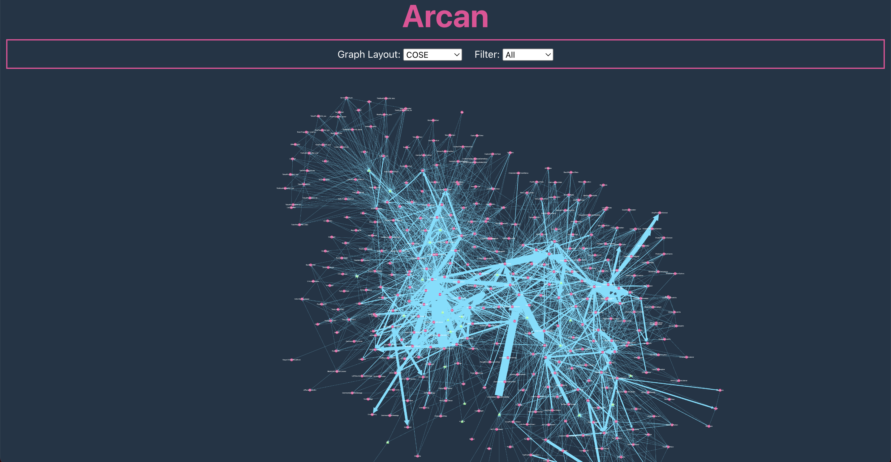

## Data Visualization Dashboard

<br/>

<br/>

---

## Source and Credit

This task is designed by Darius Sas (darius.sas@arcan.tech). For details, please download the requirement [here](public/develop-web-app-dependency-graph.pdf)

# Application Setup and Usage

This document guides you through the setup and usage of the application using Docker and Docker Compose. The application is containerized, ensuring consistency across different environments.

## Prerequisites

Before you begin, ensure you have Docker and Docker Compose installed on your system. These tools are necessary to build and run the application container.

- **Docker**: An open platform for developing, shipping, and running applications in containers.
- **Docker Compose**: A tool for defining and running multi-container Docker applications.

## Getting Started

### Clone the Repository

First, clone the application repository to your local machine using Git:

```bash
git clone <repository-url>
cd <repository-directory>
```

Replace `<repository-url>` with the actual URL of your Git repository and `<repository-directory>` with the name of the directory into which the repository is cloned.

### Build and Run the Application

The application can be easily built and started using Docker Compose. The provided `docker-compose.yml` file describes the services that make your application run, including the application environment and port mappings.

1. **Build the Application**: To build the Docker image for your application, run the following command from the root of your repository:

```bash
docker-compose build
```

This command builds the Docker image as described in the `Dockerfile`, including installing dependencies and setting up the environment.

2. **Run the Application**: To start the application, use the following Docker Compose command:

```bash
docker-compose up
```

This command starts the application as defined in the `docker-compose.yml` file, making it accessible on the configured port.

### Accessing the Application

After starting the application, it will be accessible at `http://localhost:5173` on your local machine. You can open this URL in your web browser to interact with the application.

### Development Workflow

The application is set up in a development-friendly way, using Docker volumes to map your local files into the container. This setup allows you to make changes to the application code on your host machine, which will then be reflected inside the container without needing to rebuild the image.

- **Source Code Changes**: Make changes to your application's source code on your local machine. The changes will automatically be reflected inside the running container.
- **Dependency Management**: If you need to add or update npm packages, you can do so by running npm commands inside the container. For example, to add a new package:

```bash
docker-compose exec app npm install <package-name>
```

Replace `<package-name>` with the name of the npm package you wish to add.

## Shutting Down

To stop and remove the containers, networks, and volumes created by `docker-compose up`, use the following command:

```bash
docker-compose down
```

## Conclusion

This README provides a basic overview of how to set up and run the application using Docker and Docker Compose. For more detailed information, refer to the official Docker and Docker Compose documentation.

